# Architecture Overview

This document provides a comprehensive architecture overview of the GHAS Java Demo application.

## System Architecture Diagram

```mermaid
graph TB
    subgraph "Client Layer"
        Browser[Web Browser]
    end
    
    subgraph "Application Server (Jakarta EE)"
        subgraph "Web Application (WAR)"
            subgraph "Presentation Layer"
                IndexJSP[index.jsp<br/>Home Page]
                HelloServlet[HelloServlet<br/>/hello endpoint]
            end
            
            subgraph "Application Components"
                VulnerableCmd[VulnerableCommand<br/>Demo Vulnerability]
            end
            
            subgraph "Configuration"
                WebXML[web.xml<br/>Deployment Descriptor]
            end
        end
    end
    
    subgraph "Build & Development"
        subgraph "Build System"
            Maven[Maven Build Tool]
            POM[pom.xml<br/>Dependencies & Plugins]
        end
        
        subgraph "Dependencies"
            Jakarta[Jakarta Servlet API 5.0]
            JSP[Jakarta JSP API 3.0]
            JSTL[JSTL 2.0]
            JUnit[JUnit Jupiter 5.9.3]
        end
        
        subgraph "Testing"
            Tests[HelloServletTest<br/>Unit Tests]
        end
    end
    
    subgraph "Security & CI/CD"
        subgraph "GitHub Advanced Security"
            CodeQL[CodeQL Analysis<br/>Code Scanning]
            SecretScan[Secret Scanning]
            DepReview[Dependency Review]
        end
        
        subgraph "GitHub Actions"
            Workflow[CodeQL Workflow<br/>Automated Security Scanning]
        end
    end
    
    subgraph "Deployment Targets"
        Tomcat[Apache Tomcat 10.x+]
        Jetty[Eclipse Jetty 11.x+]
        WildFly[WildFly]
        GlassFish[GlassFish]
    end
    
    Browser -->|HTTP GET/POST| IndexJSP
    Browser -->|HTTP GET/POST<br/>?name=parameter| HelloServlet
    
    IndexJSP -.->|Form Submit| HelloServlet
    HelloServlet -->|HTML Response<br/>XSS Protected| Browser
    
    Maven -->|Reads| POM
    Maven -->|Compiles| HelloServlet
    Maven -->|Compiles| VulnerableCmd
    Maven -->|Packages| WebXML
    Maven -->|Runs| Tests
    Maven -->|Produces| WAR[ghas-java-demo.war]
    
    POM -->|Declares| Jakarta
    POM -->|Declares| JSP
    POM -->|Declares| JSTL
    POM -->|Declares| JUnit
    
    Tests -->|Validates| HelloServlet
    
    WAR -->|Deploys to| Tomcat
    WAR -->|Deploys to| Jetty
    WAR -->|Deploys to| WildFly
    WAR -->|Deploys to| GlassFish
    
    Workflow -->|Triggers| CodeQL
    CodeQL -->|Scans| HelloServlet
    CodeQL -->|Detects Vulnerabilities| VulnerableCmd
    SecretScan -->|Monitors| POM
    DepReview -->|Validates| POM
    
    style Browser fill:#e1f5ff
    style WAR fill:#ffe1e1
    style CodeQL fill:#ffe1cc
    style Maven fill:#e1ffe1
    style HelloServlet fill:#f0f0f0
    style VulnerableCmd fill:#ffcccc
```



## Component Descriptions

### Presentation Layer

#### index.jsp
- **Purpose**: Main landing page for the application
- **Technology**: JavaServer Pages (JSP)
- **Features**:
  - Welcome message and application information
  - Interactive form to test the HelloServlet
  - Displays current server time
  - Responsive CSS styling

#### HelloServlet
- **URL Pattern**: `/hello`
- **HTTP Methods**: GET, POST
- **Purpose**: Greets users with a personalized message
- **Security Features**:
  - HTML escaping to prevent XSS attacks
  - Input validation and sanitization
  - Safe handling of user parameters
- **Parameters**:
  - `name` (optional): User's name for personalized greeting

### Application Components

#### VulnerableCommand
- **Purpose**: Intentional security vulnerability demonstration
- **Type**: Command Injection vulnerability
- **Usage**: Used for testing GitHub Advanced Security code scanning
- **Vulnerability**: Unsanitized user input passed to `Runtime.exec()`
- **Note**: This is intentionally vulnerable for GHAS testing purposes

### Configuration

#### web.xml
- **Purpose**: Jakarta EE deployment descriptor
- **Version**: Jakarta EE 5.0
- **Configuration**:
  - Display name and description
  - Welcome file list (index.jsp, index.html)
  - Session timeout: 30 minutes

### Build System

#### Maven (pom.xml)
- **Group ID**: com.example
- **Artifact ID**: ghas-java-demo
- **Version**: 1.0-SNAPSHOT
- **Packaging**: WAR (Web Application Archive)
- **Java Version**: 17
- **Build Output**: `target/ghas-java-demo.war`

#### Dependencies
1. **Jakarta Servlet API 5.0** (provided)
   - Core servlet functionality
2. **Jakarta JSP API 3.0** (provided)
   - JavaServer Pages support
3. **JSTL 2.0**
   - JSP Standard Tag Library
4. **JUnit Jupiter 5.9.3** (test)
   - Unit testing framework

#### Build Plugins
- **maven-compiler-plugin**: Java compilation (JDK 17)
- **maven-war-plugin**: WAR packaging
- **maven-surefire-plugin**: Test execution

### Testing

#### HelloServletTest
- **Framework**: JUnit Jupiter
- **Purpose**: Unit tests for HelloServlet
- **Location**: `src/test/java/com/example/servlet/`
- **Package**: com.example.servlet

### Security & CI/CD

#### GitHub Advanced Security Features

1. **Code Scanning (CodeQL)**
   - Language: Java
   - Build Mode: None (bytecode analysis)
   - Triggers: Push to main, Pull requests, Weekly schedule
   - Detects: Security vulnerabilities, code quality issues

2. **Secret Scanning**
   - Automatically detects committed secrets
   - Prevents credential leakage

3. **Dependency Review**
   - Scans dependencies for known vulnerabilities
   - Reviews CVEs in third-party libraries

#### GitHub Actions Workflow
- **File**: `.github/workflows/codeql.yml`
- **Name**: CodeQL Advanced
- **Schedule**: Weekly (Mondays at 3:32 AM)
- **Events**: Push to main, Pull requests

### Deployment Targets

The generated WAR file can be deployed to any Jakarta EE 9+ compatible application server:

1. **Apache Tomcat 10.x+**
   - Most popular choice
   - Lightweight servlet container

2. **Eclipse Jetty 11.x+**
   - Embedded-friendly
   - High performance

3. **WildFly**
   - Full Jakarta EE implementation
   - Enterprise features

4. **GlassFish**
   - Reference implementation
   - Complete Jakarta EE support

## Request Flow

### User Request Flow

1. User accesses the application via web browser
2. Browser sends HTTP GET request to `/` (root)
3. Application server routes to `index.jsp` (welcome file)
4. User fills form and submits to `/hello` endpoint
5. HelloServlet receives request:
   - Extracts `name` parameter
   - Validates and escapes input (XSS prevention)
   - Generates HTML response
6. Browser receives and renders the greeting page

### Build Flow

1. Developer commits code to repository
2. Maven reads `pom.xml` configuration
3. Maven downloads dependencies
4. Maven compiles Java source files:
   - `HelloServlet.java`
   - `VulnerableCommand.java`
5. Maven runs unit tests (`HelloServletTest`)
6. Maven packages application:
   - Compiles JSP pages
   - Bundles classes, libraries, and resources
   - Creates `ghas-java-demo.war`
7. WAR file ready for deployment

### Security Scanning Flow

1. Code pushed to GitHub repository
2. GitHub Actions triggers CodeQL workflow
3. CodeQL initializes for Java analysis
4. CodeQL scans source code:
   - Analyzes data flow
   - Identifies security patterns
   - Detects vulnerabilities
5. Results published to Security tab
6. Alerts created for findings (e.g., VulnerableCommand)

## Technology Stack

| Layer | Technology | Version |
|-------|-----------|---------|
| Language | Java | 17 |
| Web Framework | Jakarta Servlet | 5.0 |
| View Technology | Jakarta JSP | 3.0 |
| Tag Library | JSTL | 2.0 |
| Build Tool | Apache Maven | 3.6+ |
| Testing | JUnit Jupiter | 5.9.3 |
| Security | GitHub Advanced Security | Latest |
| Application Server | Jakarta EE 9+ Compatible | Various |

## Security Considerations

### Implemented Security Measures

1. **XSS Prevention**
   - HTML escaping in HelloServlet
   - All user input sanitized before rendering

2. **Input Validation**
   - Parameter validation in servlets
   - Default values for missing parameters

3. **Session Management**
   - 30-minute session timeout configured
   - Standard Jakarta session handling

### Intentional Vulnerabilities (for GHAS Testing)

1. **Command Injection** (VulnerableCommand)
   - Demonstrates unsanitized input to system commands
   - Used for testing CodeQL detection capabilities

### Security Scanning

- **Automated**: CodeQL runs on every push and PR
- **Scheduled**: Weekly security scans
- **Coverage**: Code scanning, secret detection, dependency review

## Build Commands

```bash
# Clean and build the project
mvn clean package

# Run tests only
mvn test

# Clean build artifacts
mvn clean

# Compile without packaging
mvn compile
```

## Deployment

```bash
# Build the WAR file
mvn clean package

# Deploy to Tomcat (example)
cp target/ghas-java-demo.war $CATALINA_HOME/webapps/

# Access the application
# http://localhost:8080/ghas-java-demo/
```

## Directory Structure

```
ghas-java-demo/
├── .github/
│   └── workflows/
│       └── codeql.yml                 # CodeQL security scanning workflow
├── src/
│   ├── main/
│   │   ├── java/
│   │   │   └── com/example/servlet/
│   │   │       ├── HelloServlet.java         # Main servlet
│   │   │       └── VulnerableCommand.java    # Demo vulnerability
│   │   └── webapp/
│   │       ├── WEB-INF/
│   │       │   └── web.xml            # Deployment descriptor
│   │       └── index.jsp              # Home page
│   └── test/
│       └── java/
│           └── com/example/servlet/
│               └── HelloServletTest.java     # Unit tests
├── pom.xml                             # Maven configuration
├── README.md                           # Project documentation
└── ARCHITECTURE.md                     # This file
```

## Future Enhancements

Potential areas for expansion:

1. **Database Integration**: Add persistence layer with JPA/Hibernate
2. **REST API**: Implement RESTful endpoints using JAX-RS
3. **Authentication**: Add user authentication and authorization
4. **Logging**: Integrate structured logging (e.g., SLF4J + Logback)
5. **Monitoring**: Add application performance monitoring
6. **Containerization**: Docker support for easier deployment
7. **Additional Security**: Implement CSRF protection, rate limiting
